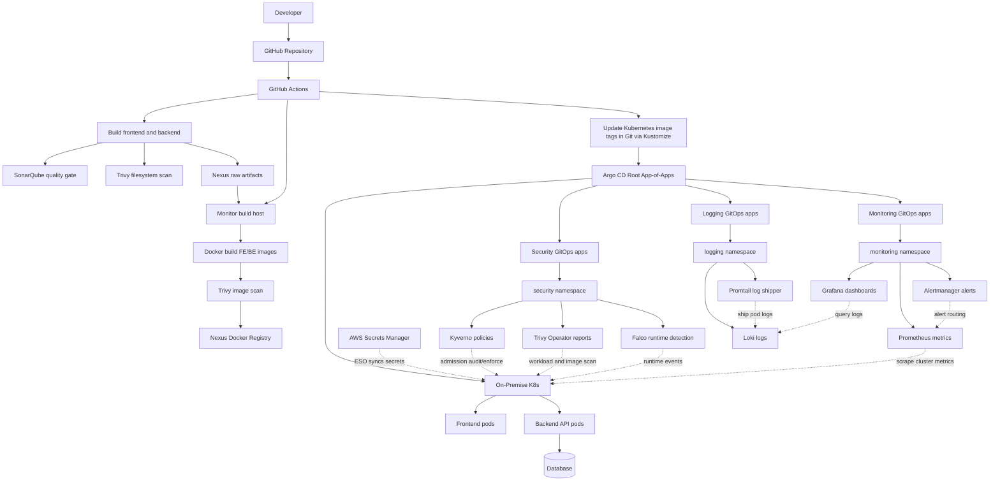

# Hospital On-Premise DevSecOps GitOps Platform


Welcome to the production-grade DevSecOps and GitOps platform repository. This repository demonstrates a highly secure, automated deployment model for a hospital management application consisting of a React/Vite frontend, an ASP.NET Core 9 backend, Docker, SonarQube, Trivy, GitHub Actions (integrated via Tailscale), Argo CD GitOps, Prometheus, Grafana, Alertmanager, Loki, Promtail, Kyverno, Trivy Operator, and Falco.

---

## Architecture Overview



---

## Repository Structure

The repository is structured to separate source code, platform configurations, and Argo CD management:

```text
.
├── .github/workflows/          # GitHub Actions DevSecOps pipeline
├── apps/                       # Source code of the workloads
│   ├── frontend/               # React/Vite frontend source code
│   └── backend/                # ASP.NET Core 9 backend API source code
├── database/                   # Database schemas and bootstrap scripts
│   └── hospital-db.sql         # Main database schema script
├── deploy/                     # GitOps & K8s deployment manifests
│   ├── argocd/                 # Argo CD control plane manifests
│   │   ├── bootstrap/          # Root App-of-Apps bootstrap application
│   │   ├── projects/           # Custom AppProjects (hospital & platform)
│   │   └── applications/       # Independent Argo CD Application manifests
│   │       ├── workloads/      # Environment-specific application workloads
│   │       └── platform/       # Core infrastructure and utility service apps
│   ├── platform/               # Cluster-wide platform components
│   │   ├── ingress/            # Ingress controllers (Traefik)
│   │   ├── caching/            # Caching stack (Redis HA)
│   │   ├── observability/      # Prometheus, Grafana, Loki, Promtail
│   │   ├── security/           # Kyverno policies, Trivy Operator, Falco, ESO configs
│   │   └── namespaces/         # Centralized namespace manifests
│   └── workloads/              # Application workloads manifests
│       ├── hospital-frontend/  # Frontend Kustomize baseline & overlays
│       └── hospital-backend/   # Backend Kustomize baseline & overlays
├── docs/                       # High-level markdown documentation
├── infrastructure/             # On-prem infrastructure configurations
│   └── on-prem/                # HAProxy configuration and node discovery script
├── scripts/                    # Utility and security setups scripts
└── services/                   # Local developer tools (Nexus & SonarQube)
```

---

## GitOps Design Decisions

### 1. Platform vs. Workload Segregation
We separate **platform workloads** (Ingress, Redis, Monitoring, Logging, Security, and External Secrets) from **application workloads** (Frontend, Backend). This segregation allows infrastructure/platform engineers to manage core platform components independently of software development lifecycles.

### 2. Least-Privilege AppProjects
Rather than using the `default` AppProject for all deployments, we configure two distinct AppProjects:
* **`platform`**: Authorized to deploy resources to all namespaces (including cluster-wide elements like CustomResourceDefinitions, ClusterRoles, and ClusterRoleBindings). Whitelists specific repository sources for community Helm charts.
* **`hospital`**: Restriced to namespaced resources within the application namespaces (`hospital-dev`, `hospital-prod`, and `hospital-stag`). It prevents the application workload from creating cluster-scoped resources or altering platform namespaces.

### 3. Root App-of-Apps (Bootstrap)
The entire platform is bootstrapped via a single Root Application located at `deploy/argocd/bootstrap/root-app.yaml`. When this manifest is applied manually:
1. Argo CD reconciles `deploy/argocd/bootstrap/kustomization.yaml`.
2. The AppProjects (`hospital` and `platform`) are created.
3. The platform control applications (namespaces, Traefik, Redis, Prometheus, Loki, Kyverno, etc.) and application workload configurations are provisioned and synchronized automatically.

### 4. Kustomize Hierarchy
Bases represent environment-agnostic blueprints.
* `base/` contains the standard `deployment.yaml`, `service.yaml`, `network-policy.yaml`, and `hpa.yaml`. The base **never** contains production replica counts, namespaces, or image tags.
* `overlays/<env>/` applies overlays (dev, prod, stag) using `kustomization.yaml` for namespace overrides, image tags, and `patch-deployment.yaml` for replica counts.

---

## DevSecOps CI/CD Flow

The GitHub Actions pipeline `.github/workflows/devsecops.yml` runs on pushes to `main` and `devops` branches.

1. **Security Gates**:
   * Restores dependencies using local dependency caches in Nexus (`nuget-group`, `npm-group`).
   * Builds the backend API and frontend React bundle.
   * Runs filesystem security analysis using Trivy CLI and code quality scans using SonarQube.
   * Packages compiled artifacts into zip files and uploads them to the Nexus Raw Repository.
2. **Build and Deploy**:
   * Uses Tailscale SSH to connect to the builder host (`monitor`).
   * Pulls the raw artifacts, builds Docker images locally, scans them with Trivy (blocking on `HIGH`/`CRITICAL` issues), and pushes them to the Nexus Docker registry (`port 8082`).
   * Runs `kustomize edit set image` inside the overlay directory (`deploy/workloads/hospital-frontend/overlays/<env>` and `deploy/workloads/hospital-backend/overlays/<env>`) to update image tags.
   * Commits the updated `kustomization.yaml` files back to GitHub.
   * Argo CD detects the git commit and reconciles the state in the cluster.

---

## Prerequisites

* **On-Premise Cluster**: Kubernetes cluster with `kubectl` access.
* **VPN**: Tailscale installed and active on the runner, build host, and cluster.
* **Dependency Managers**: Node.js 20 & .NET SDK 9 for local testing.
* **Secrets Manager**: AWS CLI configured to create parameters.

---

## Run Locally

To test the application locally without Kubernetes, run the following command from the root directory:

```bash
docker compose up --build
```

Default local endpoints:
* **Frontend**: `http://localhost:5173`
* **Backend**: `http://localhost:5247`

---

## Services Stack Setup

We host SonarQube and Sonatype Nexus Repository Manager locally using Docker Compose:

```bash
cd services
cp .env.example .env
docker compose up -d
```

| Service | Endpoint | Purpose |
|---|---|---|
| **SonarQube** | `http://100.112.150.56:9000` | Code Quality Gate |
| **Nexus** | `http://100.112.150.56:8081` | NuGet & npm caching repositories |
| **Nexus Registry** | `100.112.150.56:8082` | Private Docker Registry |

Required repositories to create in Nexus:
* `hospital-artifacts` (raw hosted): Stores frontend/backend zip artifacts.
* `nuget-group` (nuget group): NuGet proxy.
* `npm-group` (npm group): npm proxy.
* `hospital-registry` (docker hosted): Docker registry connector on port `8082`.

---

## Enterprise Secrets Management (AWS SM + ESO)

Application secrets are managed in AWS Secrets Manager and synchronized automatically in the cluster using the External Secrets Operator.

### Step 1: Create AWS Secrets Manager parameters

```bash
# 1. Database Connection String
aws secretsmanager create-secret \
  --name hospital-be-db \
  --secret-string '{"default-connection":"Server=YOUR_DB_IP;Database=HospitalDB;User Id=sa;Password=YOUR_PASSWORD;TrustServerCertificate=True"}' \
  --region us-east-1

# 2. Redis Password
aws secretsmanager create-secret \
  --name hospital-be-redis \
  --secret-string '{"password":"<redis-password>"}' \
  --region us-east-1

# 3. JWT Signing Key
aws secretsmanager create-secret \
  --name hospital-be-jwt \
  --secret-string '{"secret":"<jwt-secret-key>"}' \
  --region us-east-1

# 4. Redis HA Sentinel Auth
aws secretsmanager create-secret \
  --name hospital-redis-auth \
  --secret-string '{"password":"<redis-password>"}' \
  --region us-east-1

# 5. Nexus Docker Registry Credentials
aws secretsmanager create-secret \
  --name hospital-nexus-registry \
  --secret-string '{"username":"<nexus-username>","password":"<nexus-password>"}' \
  --region us-east-1
```

### Step 2: Bootstrap via GitOps
After creating AWS secrets and setting up AWS credentials in the cluster (`awssm-secret` in `external-secrets` namespace), Argo CD will automatically apply the `ClusterSecretStore` and individual `ExternalSecret` manifests.

Verify sync status:
```bash
kubectl get externalsecret -n hospital-prod
```
All secrets should report `SecretSynced = True`.

---

## Bootstrap and GitOps Synchronization

Apply the Root App-of-Apps application to begin the cluster provisioning:

```bash
kubectl apply -f deploy/argocd/bootstrap/root-app.yaml
```

To monitor resources:
```bash
# Monitor workloads
kubectl -n hospital-prod get deploy,pods,svc,hpa,networkpolicy

# Monitor Argo CD applications
kubectl -n argocd get applications
```

---

## Pipeline Readiness Checklist

Before committing pipeline triggers:
1. Ensure the build host `monitor` has Tailscale SSH enabled.
2. The user `monitor` must be in the `docker` group on the build VM.
3. Configure the following secrets in GitHub Actions repository settings:
   * `TAILSCALE_AUTH_KEY`: Ephemeral Tailscale VPN access key.
   * `NEXUS_URL`: Base HTTP URL of Sonatype Nexus.
   * `NEXUS_USERNAME` / `NEXUS_PASSWORD`: Credentials for raw & docker repos.
   * `GIT_USERNAME` / `GIT_PASSWORD`: Git credentials (PAT with write permission) to commit updated image tags.
   * `SONAR_TOKEN`: Project Analysis Token generated in SonarQube.

---

## Troubleshooting Guide

| Symptom | Cause | Resolution |
|---|---|---|
| Tailscale connection timeout | Expired VPN key | Regenerate Tailscale Auth Key and update GitHub secret. |
| SSH authentication failed | Tailscale SSH ACL block | Ensure Tailscale ACL authorizes runners to SSH to `monitor`. |
| `could not read Username` in CI | Invalid Git credentials | Check `GIT_USERNAME` and `GIT_PASSWORD` PAT values. |
| Trivy reports HIGH/CRITICAL | Vuln in base package | Update packages inside Dockerfiles or upgrade base images. |
| ImagePullBackOff on Pods | Registry credentials error | Check `nexus-registry-secret` creation and AWS SM syncing. |
| Argo CD Redis `i/o timeout` | Default NetPol blocking | Run `kubectl delete networkpolicy --all -n argocd`. |
| Redis Connection Timeout | Bad redis endpoint config | Set Redis string to `hospital-redis-ha:6379`. |
| BE CreateContainerConfigError | Missing secrets in K8s | Ensure ESO has synchronized all 5 Secrets Manager keys. |

---

## Security Practices Used

* **Zero Hardcoded Secrets**: Secrets are kept exclusively in AWS Secrets Manager and synced dynamically.
* **Strict AppProject Whitelisting**: The hospital application cannot deploy cluster-wide configurations.
* **Restricted Pod Security Standard**: Namespaces are labeled to enforce the `restricted` pod security standard.
* **Non-Root Runtime**: Containers run as non-root users (UID 101 for frontend, UID 1654 for backend).
* **Admission Control Policy**: Kyverno enforces limits on resources, drops capabilities, and disallows privileged execution.
* **Network Isolation**: Default deny policies block all traffic except explicit ingress routes from Traefik.
* **Zero Static SSH Keys**: Tailscale SSH dynamically authorizes actions during pipeline runs.
