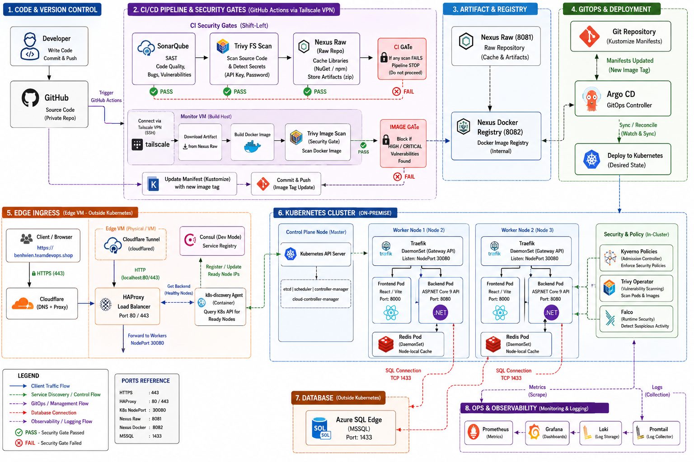
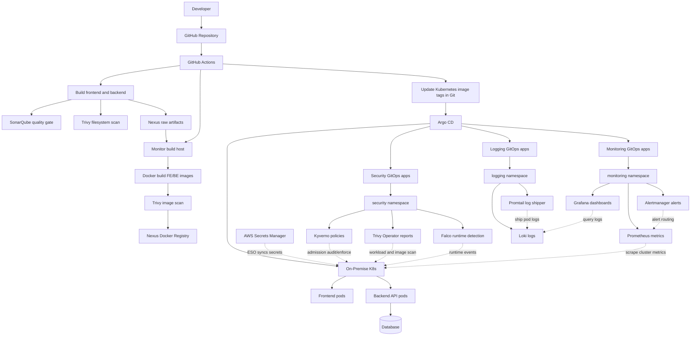
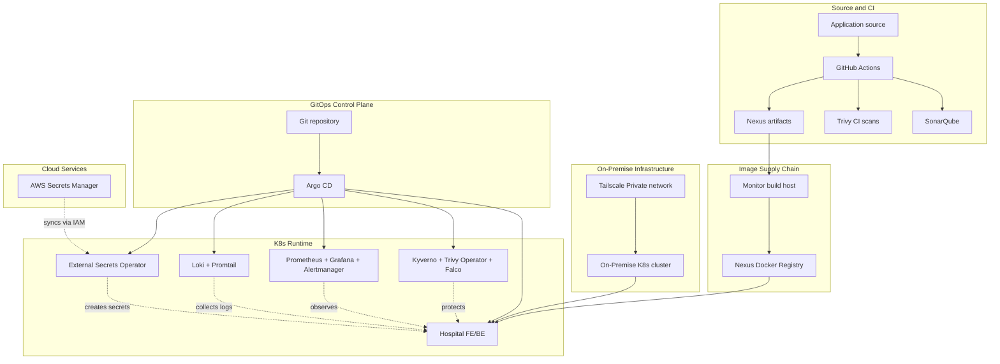
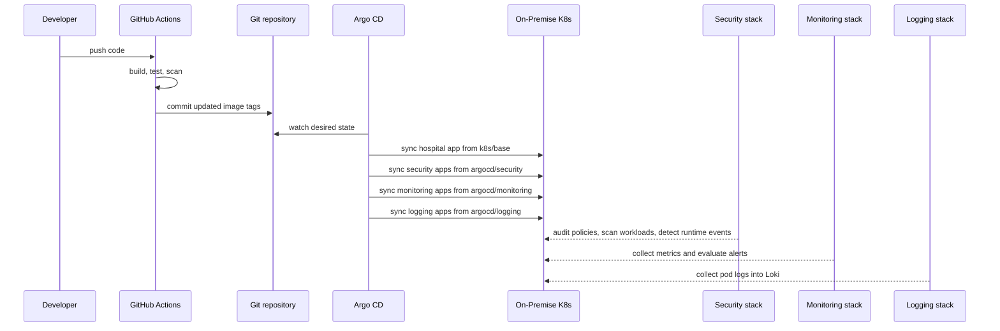

# Hospital On-Premise DevSecOps GitOps Platform


This repository is a complete learning-oriented DevSecOps platform for a hospital management application. It combines a React/Vite frontend, an ASP.NET Core 9 backend, Docker, Nexus Repository (Raw & Docker Registry), SonarQube, Trivy, GitHub Actions (connected via Tailscale), Argo CD GitOps, Prometheus, Grafana, Alertmanager, Loki, Promtail, Kyverno, Trivy Operator, and Falco.

The goal is not only to run the app, but to understand how a modern CI/CD and security delivery flow is assembled end to end.



## Table of Contents

- [Learning Objectives](#learning-objectives)
- [Architecture](#architecture)
- [Platform Layers](#platform-layers)
- [Folder Responsibility](#folder-responsibility)
- [Repository Structure](#repository-structure)
- [Current CI/CD Flow](#current-cicd-flow)
- [GitOps Runtime Flow](#gitops-runtime-flow)
- [Prerequisites](#prerequisites)
- [Run Locally](#run-locally)
- [Security Stack Setup](#security-stack-setup)
- [Monitor Build Host Setup](#monitor-build-host-setup)
- [GitHub Actions Secrets](#github-actions-secrets)
- [Nexus and Argo CD Setup](#nexus-and-argo-cd-setup)
- [Pipeline Readiness Checklist](#pipeline-readiness-checklist)
- [Troubleshooting](#troubleshooting)
- [Documentation Index](#documentation-index)

## Learning Objectives

By walking through this repository, you should be able to explain and operate:

| Area | What this project demonstrates |
|---|---|
| Infrastructure | Running on self-managed VM/Bare-metal with Tailscale VPN routing. |
| CI/CD | Building frontend/backend artifacts, scanning them, publishing images, and updating Kubernetes manifests through GitHub Actions. |
| GitOps | Using Argo CD as the cluster source-of-truth reconciler. |
| Kubernetes runtime | Deployments, Services, namespaces, probes, resources, secrets, network policy, and Kustomize overlays. |
| Supply chain security | SonarQube, Trivy filesystem scans, Nexus artifact storage, and immutable image tags. |
| Cluster security | Kyverno admission policies, Trivy Operator cluster reports, and Falco runtime detection. |
| Observability | Prometheus metrics, Grafana dashboards, Alertmanager, Loki logs, Promtail log shipping, node-exporter, kube-state-metrics, and custom Prometheus rules. |

## Architecture



## Platform Layers



High-level idea:

- GitHub Actions builds source code, runs security gates, and uploads build artifacts to Nexus.
- The monitor VM acts as a remote build host. It downloads artifacts from Nexus, builds Docker images, scans them with Trivy, and pushes them to the Nexus Docker registry.
- The workflow updates image tags in `k8s/base/*.yaml`.
- Argo CD watches Git and syncs the updated manifests to the on-premise Kubernetes cluster.
- Argo CD also manages the cluster security, monitoring, and logging stacks.

## Folder Responsibility

This repository separates GitOps installation files from Kubernetes runtime configuration:

```text
argocd/* = tells Argo CD what to install or sync
k8s/*    = Kubernetes resources used by the app and cluster tools
security/* = local/CI security services and notes outside the runtime path
onprem/* = on-prem ingress path using Traefik NodePort and HAProxy
```

Examples:

| Path | Role |
|---|---|
| `argocd/hospital-traefik-app.yaml` | Argo CD Application that syncs the app from `k8s/base`. |
| `argocd/security/` | Argo CD Applications that install Kyverno, Trivy Operator, Falco, and sync `k8s/security`. |
| `argocd/monitoring/` | Argo CD Applications that install kube-prometheus-stack and sync `k8s/monitoring`. |
| `argocd/logging/` | Argo CD Applications that install Loki, Promtail, and sync `k8s/logging`. |
| `k8s/base/` | Runtime manifests for the hospital frontend, backend, services, and network policy. |
| `k8s/security/` | Security namespace and Kyverno policies used after Kyverno is installed. |
| `k8s/monitoring/` | Monitoring namespace and custom Prometheus alert rules used after Prometheus Operator is installed. |
| `k8s/logging/` | Logging namespace and Grafana Loki datasource used after Loki is installed. |
| `onprem/` | On-premise Ingress path using HAProxy in front of Traefik NodePort. |

In short:

```text
argocd/ = install and manage
k8s/    = run and configure
onprem/ = expose an on-prem cluster using HAProxy
```

This split is intentional for learning:

| Question | Where to look |
|---|---|
| How is a tool installed into K8s? | `argocd/<tool>/...` |
| What configuration does that tool use after installation? | `k8s/<tool>/...` |
| How is the app deployed? | `argocd/hospital-traefik-app.yaml` and `k8s/base` |
| How is infrastructure created? | [Deprecated] `terraform/environments/dev` (For reference only) |
| How are code quality and artifact services run? | `security/` |


## Repository Structure

```text
.
|-- hospital_FE/              # React/Vite frontend, served by nginx as a non-root user
|-- hospital_BE/              # ASP.NET Core 9 backend API
|-- k8s/base/                 # Namespace, Deployments, Services, NetworkPolicy, Kustomize
|-- k8s/redis/                # Redis HA cache notes, troubleshooting, and secret examples
|-- k8s/security/             # Security namespace and Kyverno policy baseline
|-- k8s/monitoring/           # Monitoring namespace and custom Prometheus alert rules
|-- k8s/logging/              # Logging namespace and Grafana Loki datasource
|-- argocd/                   # Argo CD Application manifest
|-- argocd/security/          # Argo CD Applications for Kyverno, Trivy Operator, and Falco
|-- argocd/monitoring/        # Argo CD Applications for Prometheus, Grafana, and Alertmanager
|-- argocd/logging/           # Argo CD Applications for Loki and Promtail
|-- onprem/                   # HAProxy + Traefik NodePort path for on-prem clusters
|-- terraform/                # [Deprecated] AWS network and EKS infrastructure as code (reference only)
|-- security/                 # SonarQube, Nexus, Trivy, and hardening notes
|-- .github/workflows/        # GitHub Actions DevSecOps pipeline
|-- docker-compose.yml        # Local frontend/backend container runner
|-- hospital_db.sql           # Database bootstrap script
`-- DIAGRAM.drawio            # Architecture diagram source
```

Key operational files:

| File | Purpose |
|---|---|
| `.github/workflows/devsecops.yml` | Main pipeline: validate manifests, build FE/BE, run SonarQube, scan fs, build and push Docker images to Nexus via Tailscale SSH on Monitor VM, update manifests. |
| `hospital_FE/Dockerfile` | Builds the frontend and serves it with nginx on port `8000`. |
| `hospital_BE/Hospital_API/Dockerfile` | Builds the backend runtime image on port `8080`. |
| `k8s/base/05-fe-deployment.yaml` | Frontend Deployment using Nexus image. |
| `k8s/base/07-be-deployment.yaml` | Backend Deployment using Nexus image. |
| `argocd/hospital-traefik-app.yaml` | Argo CD Application that syncs Kubernetes manifests. |
| `argocd/monitoring/10-kube-prometheus-stack-app.yaml` | Argo CD Application that installs Prometheus, Grafana, and Alertmanager. |
| `argocd/logging/10-loki-app.yaml` | Argo CD Application that installs Loki for centralized logs. |

## Current CI/CD Flow

The pipeline runs on pushes to:

```text
devops
```

The pipeline skips commits containing:

```text
ci: update image tag
```

This prevents an infinite loop when the workflow commits updated Kubernetes manifests back to Git.

Main flow:

1. Validate Kubernetes manifests with Kustomize.
2. Restore dependencies through Nexus cache:
   - NuGet: `nuget-group`
   - npm: `npm-group`
3. Build the `.NET 9` backend and the `React/Vite` frontend.
4. Run Trivy filesystem scans.
5. Run SonarQube analysis when `SONAR_HOST_URL` and `SONAR_TOKEN` are configured.
6. Package build artifacts:
   - `backend-<github.sha>.zip`
   - `frontend-<github.sha>.zip`
7. Upload artifacts to the Nexus raw repository `hospital-artifacts`.
8. Connect to the `Monitor` VM (builder host) using Tailscale SSH (no static SSH private keys needed on GitHub).
9. On Monitor VM: clone/fetch the repo, download artifacts from Nexus, and build Docker images.
10. Scan Docker images with Trivy. The job fails on HIGH or CRITICAL findings.
11. Push images to the internal Nexus registry:
    - `100.112.150.56:8082/ecr-fe:<github.sha>`
    - `100.112.150.56:8082/ecr-be:<github.sha>`
12. Update image tags in `k8s/base`.
13. Argo CD detects the Git change and syncs it to the on-premise Kubernetes cluster.
14. Cluster security, monitoring, and logging continue running as GitOps-managed platform services.

## GitOps Runtime Flow



## Prerequisites

Local workstation & On-Premise cluster:

- Git
- Docker and Docker Compose
- Node.js 20, if running the frontend locally outside containers
- .NET SDK 9, if running the backend locally outside containers
- Tailscale installed on the Kubernetes cluster nodes and the Monitor VM
- kubectl
- SSH client (Tailscale SSH enabled)

DevSecOps services (Hosted internally):

- Nexus Repository Manager (`100.112.150.56:8081` / Registry port `8082`)
- SonarQube Community
- Trivy CLI

## Run Locally

Start the frontend and backend containers from the repository root:

```bash
docker compose up --build
```

Default ports:

| Service | Container | URL |
|---|---|---|
| Frontend | `cons-react` | `http://localhost:5173` |
| Backend | `cons-dotnet` | `http://localhost:5247` |

The backend needs a database connection string. In Kubernetes, the connection string is provided through a native Kubernetes Secret. Create the database secret before deploying the backend:

```bash
kubectl create secret generic be-db-secret \
  -n hospital-prod \
  --from-literal=default-connection="Server=YOUR_DB_IP;Database=hospital_db;User Id=sa;Password=YOUR_PASSWORD;TrustServerCertificate=True;" \
  --dry-run=client -o yaml | kubectl apply -f -
```


## Security Stack Setup

The `security/` folder provides SonarQube and Nexus through Docker Compose.

```bash
cd security
cp .env.example .env
docker compose up -d
```

Default local endpoints:

| Tool | URL | Purpose |
|---|---|---|
| SonarQube | `http://100.112.150.56:9000` | Static analysis and quality gates. |
| Nexus | `http://100.112.150.56:8081` | Artifact repository and dependency cache. |

Required Nexus repositories:

| Repository | Type | Purpose |
|---|---|---|
| `hospital-artifacts` | raw hosted | Stores backend/frontend zip artifacts. |
| `nuget-group` | NuGet group | Caches NuGet dependencies. |
| `npm-group` | npm group | Caches npm dependencies. |
| `hospital-registry` | docker hosted | Docker registry listening on port `8082`. |

## Monitor Build Host Setup

The workflow connects to the Monitor builder VM using Tailscale SSH:

```bash
tailscale ssh tailscale-ssh-user@monitor
```

Install base packages:

```bash
sudo apt update
sudo apt install -y git curl unzip ca-certificates
```

Install Docker:

```bash
curl -fsSL https://get.docker.com | sudo sh
sudo usermod -aG docker tailscale-ssh-user
docker --version
```

Verify the build host:

```bash
git --version
docker --version
```
Ensure the repository is cloned on the host at `/home/monitor/k8s-home` (or the configured `REPO_DIR`).
## GitHub Actions Secrets

Configure secrets in:

```text
Repository > Settings > Secrets and variables > Actions
```

Required secrets:

| Secret | Required | Purpose |
|---|---:|---|
| `TAILSCALE_AUTH_KEY` | Yes | Ephemeral auth key for the runner to connect to the Tailscale network. |
| `NEXUS_URL` | Yes | Nexus server URL. |
| `NEXUS_USERNAME` | Yes | Nexus user with read/write access to the raw artifact repository. |
| `NEXUS_PASSWORD` | Yes | Nexus password. |
| `GIT_USERNAME` | Yes | GitHub username used by the build host to fetch manifests. |
| `GIT_PASSWORD` | Yes | GitHub Personal Access Token (PAT) with write permissions to update manifests. |
| `SONAR_TOKEN` | No | SonarQube token for code quality scans. |

## Enterprise Secrets Management (External Secrets Operator)

This project uses an **Enterprise-grade Secrets Management Architecture** to prevent sensitive data (like database connection strings, passwords, and API keys) from being committed to Git or manually managed in the cluster.

**The Model:**
1. **Single Source of Truth**: All secrets reside securely in **AWS Secrets Manager**.
2. **Identity & Access**: The Kubernetes cluster securely authenticates to AWS using IAM credentials (or IAM Roles for Service Accounts).
3. **Automated Synchronization**: The **External Secrets Operator (ESO)** continuously watches AWS Secrets Manager. It automatically fetches the cloud secrets and templates them into native Kubernetes `Secret` resources in the `hospital-prod` namespace.

### Step 1: Create Secrets in AWS Secrets Manager

Run these commands using the AWS CLI to securely populate the central secret store:

```bash
# 1. Database connection string
aws secretsmanager create-secret \
  --name hospital-be-db \
  --description "Database Connection String" \
  --secret-string '{"default-connection":"Server=YOUR_DB_IP;Database=HospitalDB;User Id=sa;Password=YOUR_PASSWORD;TrustServerCertificate=True"}' \
  --region us-east-1

# 2. Redis password for backend
aws secretsmanager create-secret \
  --name hospital-be-redis \
  --description "Redis password for backend" \
  --secret-string '{"password":"<redis-password>"}' \
  --region us-east-1

# 3. JWT signing key
aws secretsmanager create-secret \
  --name hospital-be-jwt \
  --description "JWT signing key" \
  --secret-string '{"secret":"<jwt-secret-key>"}' \
  --region us-east-1

# 4. Redis auth (used by the Redis HA Helm chart)
aws secretsmanager create-secret \
  --name hospital-redis-auth \
  --description "Redis HA auth" \
  --secret-string '{"password":"<redis-password>"}' \
  --region us-east-1

# 5. Nexus image pull credentials
aws secretsmanager create-secret \
  --name hospital-nexus-registry \
  --description "Nexus Docker Registry credentials for K8s ImagePullSecrets" \
  --secret-string '{"username":"<nexus-username>","password":"<nexus-password>"}' \
  --region us-east-1
```

### Step 2: Sync via GitOps

Once the credentials exist in AWS, the GitOps pipeline takes over. Ensure your cluster is authenticated to AWS (via the `awssm-secret` IAM credentials).

ArgoCD will automatically apply the `ExternalSecret` manifests located in `k8s/overlays/prod/external-secrets.yaml`. ESO will then generate the corresponding native Kubernetes secrets (`be-db-secret`, `be-redis-secret`, `be-jwt-secret`, `redis-auth-secret`, `nexus-registry-secret`).

Verify synchronization:
```bash
kubectl get externalsecret -n hospital-prod
```
All secrets should report `SecretSynced = True`.

Render manifests locally:

```bash
kubectl kustomize k8s/base
```

Apply the application GitOps object:

```bash
kubectl apply -f argocd/hospital-traefik-app.yaml
kubectl -n argocd get applications
```

Apply the security GitOps objects:

```bash
kubectl apply -f argocd/security/10-kyverno-app.yaml
kubectl apply -f argocd/security/00-security-namespace-policies-app.yaml
kubectl apply -f argocd/security/20-trivy-operator-app.yaml
kubectl apply -f argocd/security/30-falco-app.yaml
kubectl get pods -n security
```

Apply the monitoring GitOps objects:

```bash
kubectl apply -f argocd/monitoring/10-kube-prometheus-stack-app.yaml
kubectl apply -f argocd/monitoring/20-monitoring-rules-app.yaml
kubectl get pods -n monitoring
```

Apply the logging GitOps objects:

```bash
kubectl apply -f argocd/logging/10-loki-app.yaml
kubectl apply -f argocd/logging/20-promtail-app.yaml
kubectl apply -f argocd/logging/30-logging-config-app.yaml
kubectl get pods -n logging
```

## Pipeline Readiness Checklist

Before rerunning the workflow, confirm:

- The build host is registered on the Tailscale tailnet with host name `monitor`.
- The build host has Tailscale SSH enabled.
- The build host has `git`, `docker`, and `unzip`.
- The build host user (`monitor`) is in the `docker` group.
- Nexus Docker registry is listening on port `8082` and reachable from the cluster and build host.
- CRI-O on all cluster nodes trusts the Nexus registry (`/etc/containers/registries.conf.d/100-nexus.conf`).
- Calico uses the correct interface (`IP_AUTODETECTION_METHOD=cidr=192.168.1.0/24`).
- GitHub secrets exist and contain the correct values.
- `GIT_PASSWORD` is a valid GitHub PAT with repository write access to update manifests.
- `SONAR_TOKEN` is a valid **Project Analysis Token** (not a User token).
- All 5 required secrets (`be-db-secret`, `be-redis-secret`, `be-jwt-secret`, `redis-auth-secret`, `nexus-registry-secret`) are successfully synced by ESO and show `SecretSynced = True`.
- Redis backend connection string points to `hospital-redis-ha:6379`, and Redis secrets are synced by ESO.
- ArgoCD NetworkPolicies are deleted (bare-metal clusters).
- Argo CD watches the same branch/path that the workflow updates (`devops` branch).

## Troubleshooting

| Symptom | Common cause | Fix |
|---|---|---|
| Tailscale connection timeout | Expired or incorrect `TAILSCALE_AUTH_KEY` | Regenerate Tailscale Auth Key and update GitHub Action secret. |
| SSH authentication failed | Tailscale SSH policy does not authorize access | Ensure Tailscale ACL contains SSH permissions for the GitHub runner identity to access `monitor` host. |
| `could not read Username for 'https://github.com'` | Bad GitHub username or PAT | Update `GIT_USERNAME` and `GIT_PASSWORD` with a valid PAT. |
| Nexus Registry push rejected | Authentication failure or registry misconfigured | Verify Nexus user credentials and that the `8082` Docker registry connector is active and supports V2 APIs. |
| Trivy reports HIGH/CRITICAL findings | Base image or packages contain CVEs | Upgrade the base image or update packages during the Docker build, then rerun the scan. |
| `nexus-registry-secret` not found | ImagePullBackOff on pods | Verify that ESO has successfully synced the secret from AWS Secrets Manager (`kubectl get externalsecret -n hospital-prod`). |
| Argo CD does not sync | Branch/path mismatch or app unhealthy | Check `argocd/hospital-traefik-app.yaml`, app status, and repo credentials. |
| Workflow loops repeatedly | Manifest update commit retriggers pipeline | Keep the skip guard for `ci: update image tag`. |
| Calico cross-node DNS timeout | Calico selects Tailscale interface instead of LAN | `kubectl set env ds/calico-node -n kube-system IP_AUTODETECTION_METHOD="cidr=192.168.1.0/24"` |
| ArgoCD Redis `i/o timeout` | Default NetworkPolicies block internal traffic | `kubectl delete networkpolicy --all -n argocd` then restart deployments. |
| Backend Redis timeout to `hospital-redis-ha-haproxy:6379` | Backend points to a non-existent Redis service | Set `ConnectionStrings__Redis` to `hospital-redis-ha:6379,password=$(REDIS_PASSWORD),abortConnect=false`, restart backend, and commit the manifest change. |
| BE `CreateContainerConfigError` | Missing Kubernetes secrets | Check AWS Secrets Manager and ESO sync status for `be-db-secret`, `be-redis-secret`, `be-jwt-secret`. |
| CRI-O `ImagePullBackOff` for Nexus | CRI-O does not trust HTTP registry | Add `/etc/containers/registries.conf.d/100-nexus.conf` with `insecure = true`. |
| SonarQube `not authorized to run analysis` | Token lacks Execute Analysis permission | Generate a **Project Analysis Token** in SonarQube UI, update `SONAR_TOKEN` secret. |
| Docker `sudo` errors in CI SSH | SSH user not in docker group | `sudo usermod -aG docker monitor && newgrp docker` on build host. |
| NodePort not accessible externally | Firewall or kube-proxy issue | Use `kubectl port-forward` as workaround: `kubectl port-forward svc/argocd-server -n argocd 8443:443 --address 0.0.0.0` |

## Security Practices Used

- No real passwords, tokens, private keys, or connection strings are committed.
- GitHub Actions secrets store CI/CD credentials.
- Kubernetes Secrets store runtime configuration.
- Connections between the GitHub Actions Runner, Builder VM, and On-Premise Kubernetes Cluster are established exclusively via Tailscale VPN.
- No static SSH keys are saved; authentication uses Tailscale SSH dynamic authorization.
- Containers run as non-root users where possible.
- Image tags use immutable commit SHAs.
- Trivy blocks the pipeline on HIGH or CRITICAL image vulnerabilities.

## Documentation Index

| Document | Content |
|---|---|
| `security/README.md` | SonarQube, Nexus, and Trivy overview. |
| `security/nexus/README.md` | Nexus repositories and credentials. |
| `security/sonarqube/README.md` | SonarQube token, scanner, and quality gate setup. |
| `security/trivy/README.md` | Trivy filesystem, image, and IaC scanning. |
| `k8s/security/README.md` | Security namespace and Kyverno policies used in the cluster. |
| `argocd/security/README.md` | GitOps installation of Kyverno, Trivy Operator, and Falco. |
| `k8s/monitoring/README.md` | Monitoring namespace and custom Prometheus alert rules. |
| `argocd/monitoring/README.md` | GitOps installation of Prometheus, Grafana, and Alertmanager. |
| `k8s/logging/README.md` | Logging namespace, Loki datasource, and local storage plan. |
| `argocd/logging/README.md` | GitOps installation of Loki and Promtail. |
| `k8s/README.md` | Kubernetes manifests, namespace, services, and secrets. |
| `k8s/redis/README.md` | Redis HA cache configuration, memory inspection, and cache test commands. |
| `argocd/README.md` | GitOps deployment with Argo CD. |
| `onprem/README.md` | On-prem HAProxy Ingress deployment path. |
| `onprem/haproxy/README.md` | HAProxy edge load balancer setup, TLS, reload, and troubleshooting. |
| `hospital_FE/README.md` | Frontend React/Vite/nginx notes. |
| `hospital_BE/README.md` | Backend ASP.NET Core notes. |

## Expected Result

When everything is configured correctly, a push to `devops` should produce this delivery chain:

```text
Source code -> Build -> Security gates -> Nexus artifacts -> Tailscale SSH build host
-> Docker image build -> Trivy image scan -> Nexus registry push -> Manifest update -> Argo CD sync
```

Final validation commands:

```bash
kubectl -n hospital-prod get deploy,pods,svc,daemonset
kubectl -n argocd get applications
```
