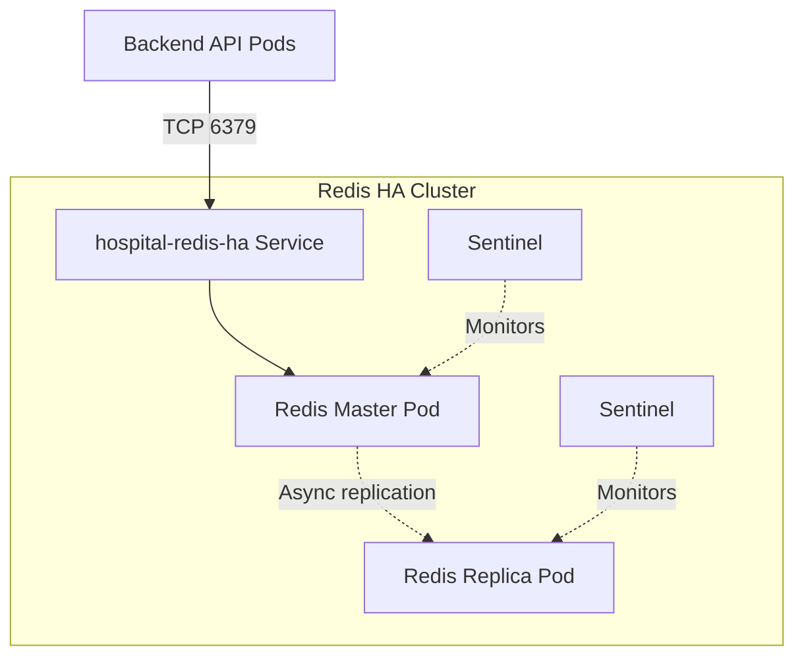

# Redis HA Cache For Hospital Workloads

Redis is used by the Hospital backend as an ASP.NET Core distributed cache. The
current production deployment is managed by Argo CD with the Bitnami Redis Helm
chart at `argocd/hospital-redis-ha-app.yaml`.

The backend connects to the Kubernetes service:

```text
hospital-redis-ha:6379
```

Do not point the backend at `hospital-redis-ha-haproxy`; that service is not
present in the current release. The backend connection string is configured in
`k8s/base/07-be-deployment.yaml`:

```yaml
ConnectionStrings__Redis: hospital-redis-ha:6379,password=$(REDIS_PASSWORD),abortConnect=false
```

## Architecture



## Runtime Behavior

- Redis is an in-memory cache for API response data.
- Persistence is disabled in the Helm values, so cache data lives in pod RAM and
  can be rebuilt by the application.
- The backend uses `AddStackExchangeRedisCache` with `InstanceName = "hospital:"`.
- Cache keys therefore start with `hospital:`.
- ASP.NET Core `IDistributedCache` stores values as Redis hashes, so inspect
  cached API responses with `HGETALL`, not `GET`.
- Current Doctor cache TTL is 300 seconds from `[RedisCache("doctor", 300)]`.

## Secrets

Redis credentials are not committed to Git.

| Source | Kubernetes target | Used by |
|---|---|---|
| AWS Secrets Manager `hospital-redis-auth` property `password` | `redis-auth-secret` | Redis Helm chart |
| AWS Secrets Manager `hospital-be-redis` property `password` | `be-redis-secret` | Backend `REDIS_PASSWORD` env |

The two passwords must match unless Redis and backend auth are intentionally
changed together.

Verify ESO synchronization:

```bash
kubectl get externalsecret -n hospital-prod
kubectl get secret -n hospital-prod redis-auth-secret be-redis-secret
```

## Connectivity Checks

Check Redis services and pods:

```bash
kubectl get svc -n hospital-prod | grep redis
kubectl get pods -n hospital-prod -o wide | grep redis
```

Check the backend Redis connection string:

```bash
kubectl exec -n hospital-prod deploy/be-deployment-v1 -- \
  printenv | grep ConnectionStrings__Redis
```

Expected value:

```text
ConnectionStrings__Redis=hospital-redis-ha:6379,password=<redacted>,abortConnect=false
```

If it points to `hospital-redis-ha-haproxy`, update the deployment or GitOps
manifest and restart the backend.

## Test API Cache

Call a cached endpoint twice:

```bash
curl -i https://benhvien.teamdevops.shop/api/Doctor
curl -i https://benhvien.teamdevops.shop/api/Doctor
```

Expected headers:

```text
X-Cache: MISS
X-Cache: HIT
```

`MISS` means the backend read from the database and wrote the response to Redis.
`HIT` means the backend served the response from Redis.

## Inspect Cached Keys

Set the Redis password in the shell before running Redis CLI commands:

```bash
export REDISCLI_AUTH='<redis-password>'
```

List Hospital cache keys:

```bash
kubectl exec -n hospital-prod hospital-redis-ha-node-0 -c redis -- \
  redis-cli --scan --pattern 'hospital:*'
```

Check the key type:

```bash
kubectl exec -n hospital-prod hospital-redis-ha-node-0 -c redis -- \
  redis-cli TYPE 'hospital:response-cache:doctor:v1:/api/Doctor'
```

Read a cached response. `IDistributedCache` stores the value as a hash:

```bash
kubectl exec -n hospital-prod hospital-redis-ha-node-0 -c redis -- \
  redis-cli HGETALL 'hospital:response-cache:doctor:v1:/api/Doctor'
```

Check TTL and memory used by the cached response:

```bash
kubectl exec -n hospital-prod hospital-redis-ha-node-0 -c redis -- \
  redis-cli TTL 'hospital:response-cache:doctor:v1:/api/Doctor'

kubectl exec -n hospital-prod hospital-redis-ha-node-0 -c redis -- \
  redis-cli MEMORY USAGE 'hospital:response-cache:doctor:v1:/api/Doctor'
```

## Inspect RAM Usage

Redis stores cache data in RAM. Check memory usage:

```bash
kubectl exec -n hospital-prod hospital-redis-ha-node-0 -c redis -- \
  redis-cli INFO memory
```

Important fields:

| Field | Meaning |
|---|---|
| `used_memory_human` | Logical memory used by Redis. |
| `used_memory_dataset` | Approximate memory used by actual key/value data. |
| `used_memory_rss_human` | Memory allocated to the Redis process by the OS. |
| `maxmemory` | Configured Redis memory limit. `0` means no Redis-level limit. |
| `maxmemory_policy` | Eviction behavior. `noeviction` means writes fail if memory is exhausted. |

Check the number of keys:

```bash
kubectl exec -n hospital-prod hospital-redis-ha-node-0 -c redis -- \
  redis-cli DBSIZE
```

## Replication Checks

Check whether the pod is master or replica and whether replicas are online:

```bash
kubectl exec -n hospital-prod hospital-redis-ha-node-0 -c redis -- \
  redis-cli INFO replication
```

Healthy master output includes:

```text
role:master
connected_slaves:1
slave0:...,state=online,...
```

## Common Issues

| Symptom | Cause | Fix |
|---|---|---|
| `/api/Doctor` returns HTTP 500 and logs show `UnableToConnect on hospital-redis-ha-haproxy:6379` | Backend points to a non-existent Redis service. | Set `ConnectionStrings__Redis` to `hospital-redis-ha:6379,password=$(REDIS_PASSWORD),abortConnect=false`, restart backend, and commit the manifest change. |
| `GET <cache-key>` returns `WRONGTYPE` | The key is a Redis hash created by .NET `IDistributedCache`. | Use `TYPE` and `HGETALL`. |
| First API call has `X-Cache: MISS` | Cache key did not exist yet or TTL expired. | Call the same endpoint again and expect `X-Cache: HIT`. |
| Redis CLI warns about password on command line | `-a` exposes the password in command history/process args. | Prefer `export REDISCLI_AUTH='<redis-password>'`. |
