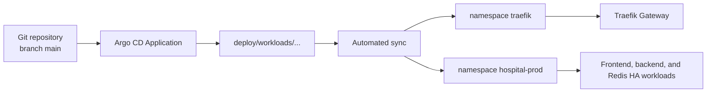
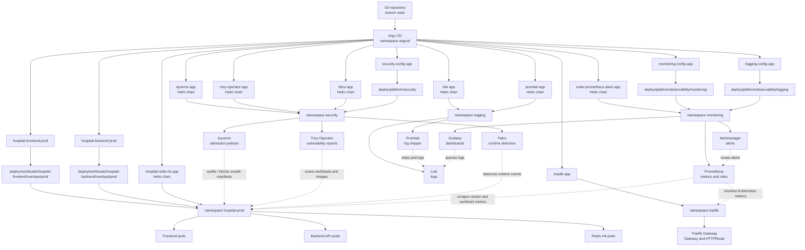
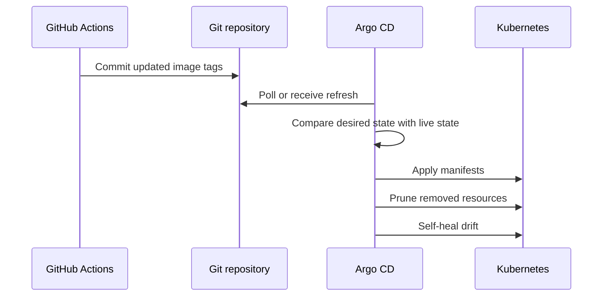
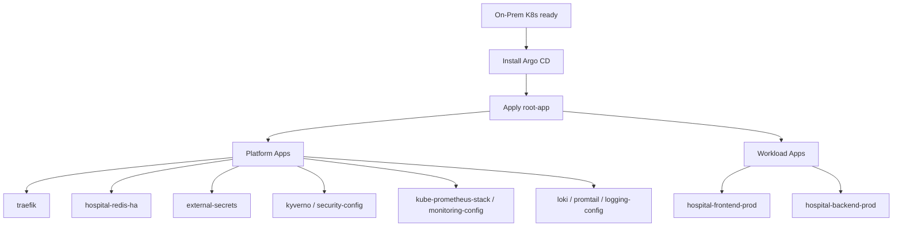

# Argo CD GitOps


This folder contains Argo CD `Application` manifests. These files tell Argo CD what to install or sync into the on-premise Kubernetes cluster.

Argo CD is the desired-state controller for the cluster. Git is the source of truth, and manual cluster changes may be reverted when self-heal is enabled.


## Folder Responsibility

```text
deploy/argocd/    = GitOps installation and sync definitions (applications, projects, bootstrap)
deploy/platform/  = Core infrastructure and platform configuration (ingress, monitoring, security, etc.)
deploy/workloads/ = Application workload configurations (frontend, backend)
```

Examples:

| Argo CD application manifest path | What it does | Runtime / Config path |
|---|---|---|
| `deploy/argocd/applications/workloads/hospital-frontend-prod.yaml` | Syncs the frontend app (production). | `deploy/workloads/hospital-frontend/overlays/prod` |
| `deploy/argocd/applications/workloads/hospital-backend-prod.yaml` | Syncs the backend app (production). | `deploy/workloads/hospital-backend/overlays/prod` |
| `deploy/argocd/applications/platform/traefik.yaml` | Installs Traefik Ingress Controller. | `deploy/platform/ingress/traefik` |
| `deploy/argocd/applications/platform/kyverno.yaml` | Installs Kyverno policy engine from Helm. | `security` namespace |
| `deploy/argocd/applications/platform/security-config.yaml` | Syncs Kyverno cluster policies & External Secrets. | `deploy/platform/security` |
| `deploy/argocd/applications/platform/kube-prometheus-stack.yaml` | Installs Prometheus, Grafana, and Alertmanager from Helm. | `monitoring` namespace |
| `deploy/argocd/applications/platform/monitoring-config.yaml` | Syncs Prometheus alert rules. | `deploy/platform/observability/monitoring` |
| `deploy/argocd/applications/platform/loki.yaml` | Installs Loki log aggregator from Helm. | `logging` namespace |
| `deploy/argocd/applications/platform/promtail.yaml` | Installs Promtail log shipper from Helm. | `logging` namespace |
| `deploy/argocd/applications/platform/logging-config.yaml` | Syncs Loki datasource ConfigMap. | `deploy/platform/observability/logging` |

## Learning Map

| Concept | Local example |
|---|---|
| App of apps mindset | Security, monitoring, and logging are represented as separate Argo CD Applications, bootstraped by the Root App. |
| Helm through Argo CD | `deploy/argocd/applications/platform/kyverno.yaml`, `.../kube-prometheus-stack.yaml`, and `.../loki.yaml`. |
| Kustomize through Argo CD | `deploy/argocd/applications/workloads/*`, `.../security-config.yaml`, `.../monitoring-config.yaml`, and `.../logging-config.yaml`. |
| Self-healing | Application specs use `syncPolicy.automated.selfHeal`. |
| Drift control | Application specs use `syncPolicy.automated.prune`. |

## Architecture



## Architecture With Security And Monitoring



Runtime model:

1. GitHub Actions updates image tags in Git after build and image scanning.
2. Argo CD syncs the app manifests from `deploy/workloads/.../base` into the `hospital-prod` and `traefik` namespaces using Kustomize overlays.
3. Argo CD also installs the security tools from `deploy/argocd/applications/platform/`.
4. Kyverno checks Kubernetes resources at admission time. Policies are currently in `Audit` mode.
5. Trivy Operator scans live cluster workloads and produces vulnerability/config reports.
6. Falco watches running containers and reports suspicious runtime behavior.
7. Prometheus collects cluster metrics, Grafana visualizes them, and Alertmanager handles alerts.
8. Promtail ships pod logs to Loki, and Grafana uses Loki as a log datasource.

The important split is:

```text
deploy/argocd/applications/platform/ = install/manage tools (helm charts)
deploy/platform/                     = configure/customize those tools after they exist (policies, rules, datasources)
```

## Files

| File/Folder | Purpose |
|---|---|
| `deploy/argocd/bootstrap/` | Root bootstrap application to deploy the whole stack. |
| `deploy/argocd/applications/workloads/` | Argo CD Applications for environment-specific app workloads. |
| `deploy/argocd/applications/platform/` | Argo CD Applications that install platform tools (Traefik, Prometheus, Loki, Kyverno, etc.). |
| `deploy/platform/` | Cluster-wide platform runtime configuration (observability rules, namespaces, ingress routes). |
| `deploy/workloads/` | Application workloads manifests (frontend, backend) organized by Kustomize. |
| `argocd-SETUP.md` | Step-by-step Argo CD installation notes. |
| `images/` | Documentation images. |

## Application Configuration (Root Bootstrap)

| Setting | Value |
|---|---|
| Repository | `https://github.com/Kien-devops/k8s-home.git` |
| Target revision | `main` |
| Manifest path | `deploy/argocd/bootstrap` |
| Destination server | `https://kubernetes.default.svc` |
| Destination namespace | `argocd` |
| Automated sync | Enabled |
| Prune | Enabled |
| Self-heal | Enabled |

## Deployment Flow



## Bootstrap Order



## Apply the Root Application

Run on a host with cluster access to bootstrap the entire stack:

```bash
kubectl apply -f deploy/argocd/bootstrap/root-app.yaml
```

Alternatively, apply the bootstrap kustomization directly:

```bash
kubectl apply -k deploy/argocd/bootstrap/
```

## Access the Argo CD UI

Port-forward the API server:

```bash
kubectl port-forward svc/argocd-server -n argocd 8080:443 --address 0.0.0.0
```

Open:

```text
https://<server-ip>:8080
```

Get the initial admin password:

```bash
kubectl -n argocd get secret argocd-initial-admin-secret -o jsonpath="{.data.password}" | base64 -d
echo
```

## Verify Sync

```bash
kubectl -n argocd get applications
kubectl -n argocd describe application hospital-frontend-prod
kubectl -n argocd get application kyverno trivy-operator falco security-config
kubectl -n argocd get application kube-prometheus-stack monitoring-config
kubectl -n argocd get application loki promtail logging-config
kubectl get pods -n hospital-prod
kubectl get pods -n traefik
kubectl get pods -n security
kubectl get pods -n monitoring
kubectl get pods -n logging
kubectl get clusterpolicy
kubectl get vulnerabilityreports -A
kubectl get prometheusrule -n monitoring
kubectl get gateway,httproute -n hospital-prod
```

Access Grafana:

```bash
kubectl port-forward -n monitoring svc/kube-prometheus-stack-grafana 3000:80
```

Open:

```text
http://localhost:3000
```

To fetch the auto-generated Grafana admin password (default credentials are user `admin` and password `prom-operator` unless changed):

```bash
kubectl get secret -n monitoring kube-prometheus-stack-grafana -o jsonpath="{.data.admin-password}" | base64 -d
echo
```

If you use the Argo CD CLI:

```bash
argocd app get hospital-frontend-prod
argocd app sync hospital-frontend-prod
```

## Operational Notes

| Topic | Guidance |
|---|---|
| Manual edits | Avoid `kubectl edit` for managed resources. Commit the change to Git instead. |
| Runtime secrets | Secrets such as `be-db-secret`, `redis-auth-secret`, and `nexus-registry-secret` are securely managed via HashiCorp Vault and synced into the cluster namespaces by External Secrets Operator (ESO). |
| Image deployment | GitHub Actions updates image tags in Git, then Argo CD syncs. |
| Drift | Self-heal will bring live resources back to Git state. |
| Prune | Deleted manifests can delete live resources during sync. Review changes carefully. |

## Troubleshooting

| Symptom | Check |
|---|---|
| Application is OutOfSync | Review changed resources and sync status. |
| Application is Degraded | Inspect pod status, events, and CRD readiness. |
| Sync fails on Gateway resources | Gateway API CRDs and Traefik CRDs must exist. |
| Image pull errors after sync | Check ESO sync status for `nexus-registry-secret`, image tag, registry connectivity. |
| Manual changes disappear | Expected behavior when self-heal is enabled. |
