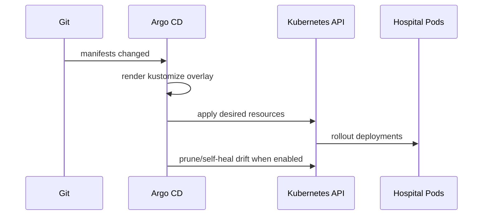

# Kubernetes Manifests


This folder explains the Kubernetes manifests located in the `deploy/` directory, which are deployed and managed by Argo CD GitOps.

The `deploy/` folder acts as the GitOps repository layout, housing platform components under `deploy/platform/` and workloads under `deploy/workloads/`.


## Learning Map

| Topic | Where it appears |
|---|---|
| Frontend workload & overlays | `deploy/workloads/hospital-frontend/` |
| Backend workload & overlays | `deploy/workloads/hospital-backend/` |
| Redis HA caching stack | `deploy/platform/caching/redis/` |
| Ingress configuration (Traefik Gateway) | `deploy/platform/ingress/traefik/` |
| Cluster security configuration | `deploy/platform/security/` |
| Cluster monitoring configuration | `deploy/platform/observability/monitoring/` |
| Cluster logging configuration | `deploy/platform/observability/logging/` and `/promtail/` |
| Centralized Namespaces | `deploy/platform/namespaces/` |
| GitOps installer layer | `deploy/argocd/` |

## Architecture

```mermaid
flowchart TB
  argocd[Argo CD] --> kustomize[kustomize build deploy/workloads/hospital-*/overlays/env]
  kustomize --> ns[hospital-dev/stag/prod namespace]
  ns --> fe[Frontend Deployment]
  ns --> be[Backend Deployment]
  fe --> fesvc[Frontend Service]
  be --> besvc[Backend Service]
  be --> secret[be-db-secret (synced via ESO from Vault)]
  ns --> np[Network Policies]
  ingress[Traefik Gateway] --> fesvc
  ingress --> besvc
```

## Deployment Workflow



## Structure

```text
deploy/
  argocd/                 # Argo CD applications and projects configurations
    bootstrap/            # Root bootstrap app
    projects/             # AppProjects
    applications/         # Independent platform & workload application definitions
  platform/               # Cluster-wide infrastructure resources
    namespaces/           # Namespaces definition
    ingress/              # Traefik configuration
    caching/              # Redis HA configuration
    observability/        # Monitoring, Logging, Promtail configuration
    security/             # Kyverno policies, Trivy Operator, Falco configuration
  workloads/              # Application workload configurations
    hospital-frontend/    # Frontend React app manifests
      base/               # Standard frontend deployment & service
      overlays/           # Environment overrides (dev, stag, prod)
    hospital-backend/     # Backend ASP.NET Core app manifests
      base/               # Standard backend deployment & service
      overlays/           # Environment overrides (dev, stag, prod)
```

## Runtime Responsibility

| Path | Purpose | Managed/Synced by Argo CD App |
|---|---|---|
| `deploy/workloads/hospital-frontend` | Frontend deployment overlays. | `hospital-frontend-prod` |
| `deploy/workloads/hospital-backend` | Backend deployment overlays & secrets sync. | `hospital-backend-prod` |
| `deploy/platform/caching/redis` | Redis HA configuration, backup CronJobs & secrets examples. | `hospital-redis-ha` |
| `deploy/platform/security` | Kyverno policies and security configs. | `security-config` |
| `deploy/platform/observability/monitoring` | Prometheus rules and Monitoring Gateway Routes. | `monitoring-config` |
| `deploy/platform/observability/logging` | Grafana Loki datasource configuration. | `logging-config` |

## Environments

| Environment | Overlay Path | Namespace | Replicas |
|---|---|---|---|
| dev | `deploy/workloads/hospital-*/overlays/dev` | `hospital-dev` | 1 frontend, 1 backend |
| stag | `deploy/workloads/hospital-*/overlays/stag` | `hospital-stag` | 2 frontend, 2 backend |
| prod | `deploy/workloads/hospital-*/overlays/prod` | `hospital-prod` | 3 frontend, 3 backend |

## Apply Manually (Fallback / Testing)

```bash
kubectl apply -k deploy/workloads/hospital-frontend/overlays/dev
kubectl apply -k deploy/workloads/hospital-backend/overlays/dev
```

## Required Secrets

To maintain security and GitOps compliance, secrets are not checked into Git. Instead, the project uses **HashiCorp Vault** as the central secrets engine, and the **External Secrets Operator (ESO)** automatically synchronizes them into the cluster as Kubernetes secrets (e.g. `be-db-secret`, `redis-auth-secret`, `nexus-registry-secret`).

See [k8s-SETUP.md](file:///e:/O%20D/project%2003/k8s-home/docs/k8s-SETUP.md) for full instructions on configuring Vault and secrets synchronization.

### Manual Secrets Creation (Local Testing / Fallback)

If you are testing locally and need to bootstrap the dev secrets manually without Vault:

```bash
# Create namespace first
kubectl apply -f deploy/platform/namespaces/hospital-dev.yaml

# Create database connection secret
kubectl -n hospital-dev create secret generic be-db-secret \
  --from-literal=default-connection="Server=<DB_IP>;Database=HospitalDB;User Id=sa;Password=<DB_PASSWORD>;TrustServerCertificate=True"

# Create Redis password secrets
kubectl -n hospital-dev create secret generic redis-auth-secret \
  --from-literal=password='<strong-redis-password>'

kubectl -n hospital-dev create secret generic be-redis-secret \
  --from-literal=password='<strong-redis-password>'

# Create JWT secret
kubectl -n hospital-dev create secret generic be-jwt-secret \
  --from-literal=secret='<jwt-secret-key>'

# Create Nexus Image Pull Secret
kubectl -n hospital-dev create secret docker-registry nexus-registry-secret \
  --docker-server=100.112.150.56:8082 \
  --docker-username=<nexus-username> \
  --docker-password=<nexus-password>
```

## Verify

```bash
kubectl get pods,svc -n hospital-dev
kubectl describe deployment hospital-backend -n hospital-dev
kubectl describe deployment hospital-frontend -n hospital-dev
```
