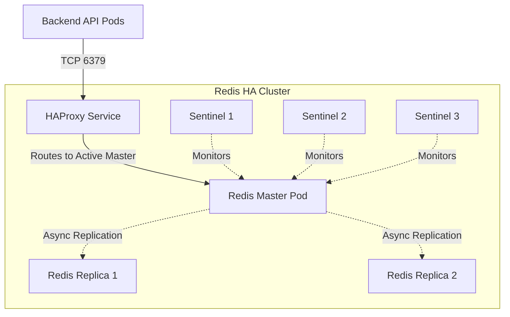

# Redis HA (High Availability) For Hospital Workloads

This folder previously contained the legacy DaemonSet-based node-local Redis setup.
The architecture has been upgraded to a **true Enterprise High Availability (HA)** model using the Bitnami Redis Helm Chart. 

The installation is managed purely via GitOps through the ArgoCD application at `argocd/hospital-redis-ha-app.yaml`.

## Architecture: Master-Replica with Sentinel & HAProxy



### Key Design Choices

1. **In-Memory Pure Cache (No Persistence)**
   To optimize IOPS and eliminate latency, disk persistence (`hostPath`, `AOF`, `RDB`) is completely disabled. Redis operates purely in-memory.
   Data loss is prevented because the data is synchronized and held simultaneously in the RAM of 3 separate pods (1 Master, 2 Replicas) running across the cluster.
   
2. **Automated Failover (Sentinel)**
   If the node running the Master pod crashes, the Sentinel quorum automatically promotes one of the Replicas to become the new Master within seconds. The data on its RAM is immediately available.

3. **Zero-Code-Change for Backend (HAProxy)**
   Typically, applications must implement Sentinel-specific libraries to detect the current Master. To avoid changing the C# `.NET` connection logic, we deploy **HAProxy** as an intermediary. 
   HAProxy tracks Sentinel events and always exposes a static DNS endpoint (`hospital-redis-ha-haproxy:6379`) pointing to the active Master. The backend connects to this endpoint like a standard, single Redis server.

## Deployment & Configuration

The deployment is fully automated by ArgoCD. 

**Application Manifest:**
`argocd/hospital-redis-ha-app.yaml`

**Helm Chart Used:**
`bitnami/redis` (Architecture: `replication`)

## Security

Redis credentials are required for connection. To adhere to GitOps principles, no plain-text passwords exist in the cluster configuration.

1. The password is created in **AWS Secrets Manager** (`hospital-redis-auth`).
2. **External Secrets Operator (ESO)** syncs it to a Kubernetes Secret named `redis-auth-secret`.
3. The Bitnami Helm Chart natively consumes this existing Secret to secure the Master, Replicas, and Sentinel nodes.

## Troubleshooting

If you need to verify cluster health, you can connect to the Redis CLI on the master pod and check replication status:

```bash
# Connect to the Redis Master
kubectl exec -it hospital-redis-ha-master-0 -n hospital-prod -- bash

# Authenticate and check replication
REDISCLI_AUTH=$REDIS_PASSWORD redis-cli info replication
```

Check the status of the HAProxy router:
```bash
kubectl get pods -n hospital-prod -l app.kubernetes.io/component=haproxy
```
