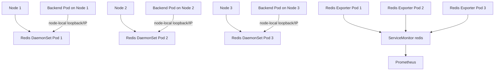

# Redis For Hospital Workloads

This folder deploys Redis for the `hospital-prod` namespace.

## Architecture



To optimize cache lookup performance and eliminate latency overhead, Redis is deployed as a **DaemonSet** bound to a node-local host port. Each Kubernetes node runs exactly one standalone Redis instance. Backend API pods discover and connect to their node-local Redis instance using the node's IP (`status.hostIP`).

## Files

| File | Purpose |
|---|---|
| `10-redis-configmap.yaml` | Redis standalone configuration. |
| `20-redis-services.yaml` | Service configuration mapping to port `6379` and metrics port `9121`. |
| `30-redis-daemonset.yaml` | DaemonSet containing Redis and redis-exporter containers, binding to node hostPorts. |
| `50-redis-networkpolicy.yaml` | Restricts access to Redis ports from allowed pods. |
| `backend-redis-secret.example.yaml` | Example Redis credentials secret. |
| `kustomization.yaml` | Resources list for Kustomize build. |

## Storage

This cache implementation uses node-local storage. Pods mount an **`emptyDir`** volume (`/data`) for volatile storage.
This design removes dependencies on cloud-specific block storage (such as AWS EBS gp3) or external PersistentVolumeClaims, making it fully self-managed and compliant with on-premises infrastructure.

## Create The Redis Secret

Define a Kubernetes Secret containing the Redis password before deploying the workload:

```bash
kubectl create secret generic redis-auth-secret \
  -n hospital-prod \
  --from-literal=password='<strong-password>' \
  --dry-run=client -o yaml | kubectl apply -f -
```

## Deploy

Apply the Redis DaemonSet and configuration:

```bash
kubectl apply -k k8s/redis
```

Verify the DaemonSet and its pods:

```bash
kubectl get daemonset redis-daemonset -n hospital-prod
kubectl get pods -n hospital-prod -l app.kubernetes.io/name=redis
```

## Application Connection

The backend API dynamically discovers its node-local Redis instance by retrieving the node's IP address (`HOST_IP`) from the Kubernetes Downward API:

```yaml
env:
  - name: HOST_IP
    valueFrom:
      fieldRef:
        fieldPath: status.hostIP
  - name: REDIS_PASSWORD
    valueFrom:
      secretKeyRef:
        name: redis-auth-secret
        key: password
  - name: ConnectionStrings__RedisConnection
    value: $(HOST_IP):6379,password=$(REDIS_PASSWORD),ssl=false,abortConnect=false
```

## Check Redis Status

You can ping the node-local Redis instance from within any of the DaemonSet pods:

```bash
kubectl exec -it -n hospital-prod <redis-pod-name> -c redis -- redis-cli -a '<strong-password>' ping
```

Verify replication status (should indicate standalone mode: `role:master` and `connected_slaves:0`):

```bash
kubectl exec -it -n hospital-prod <redis-pod-name> -c redis -- redis-cli -a '<strong-password>' info replication
```

## Metrics

Each DaemonSet pod includes a `redis-exporter` sidecar container listening on hostPort `9121`. Prometheus scrapes these metrics to monitor cache health.

Useful Prometheus metrics:

```text
redis_up
redis_connected_clients
redis_memory_used_bytes
```
